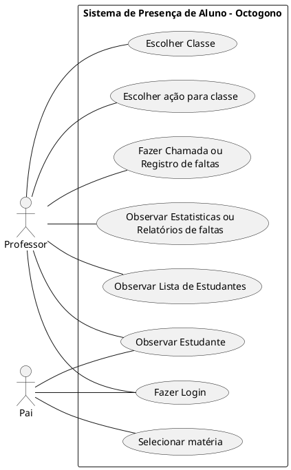

```plantuml
@startuml
left to right direction
actor Professor
actor Pai
rectangle "Sistema de Presença de Aluno - Octogono" {
    Professor -- (Fazer Login)
    Professor -- (Escolher Classe)
    Professor -- (Escolher ação para classe)
    Professor -- (Fazer Chamada ou\nRegistro de faltas)
    Professor -- (Observar Estatisticas ou\nRelatórios de faltas)
    Professor -- (Observar Lista de Estudantes)
    Professor -- (Observar Estudante)
    Pai -- (Fazer Login)
    Pai -- (Selecionar matéria)
    Pai -- (Observar Estudante)  
}
@enduml
```