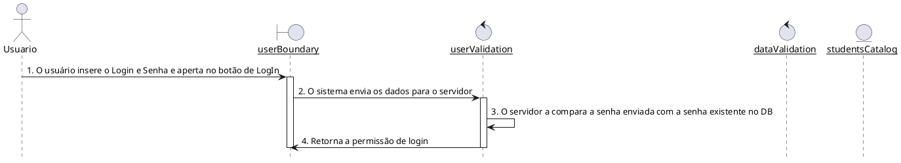
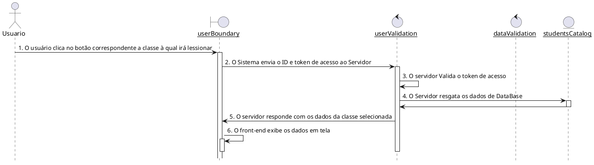
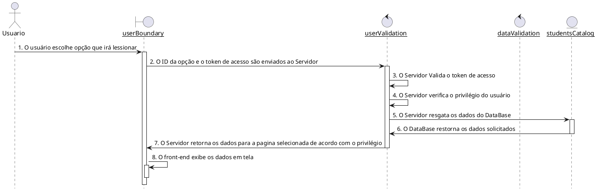
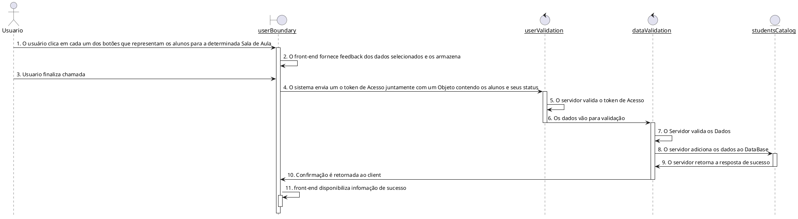
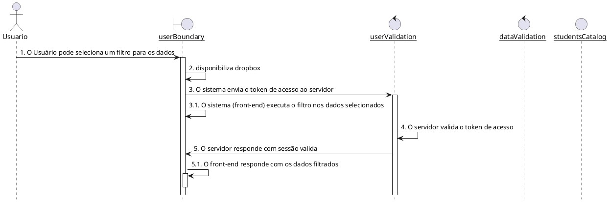
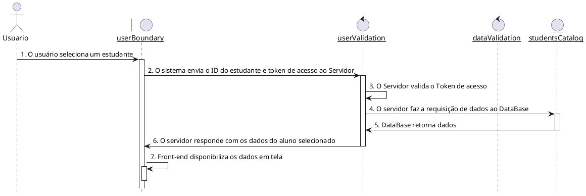
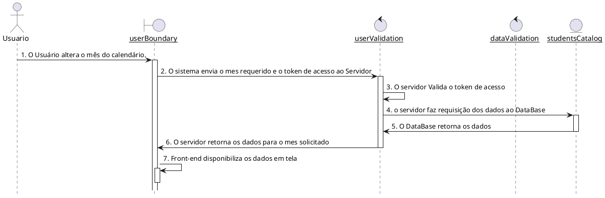
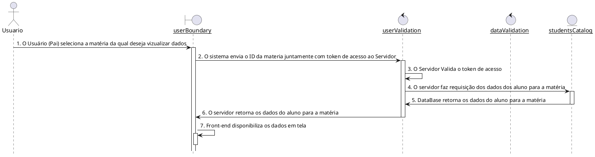

### Fazer Login - ( CDU001 )

### Escolher Classe - ( CDU002 )

### Escolher ação para classe - ( CDU003 )

### Fazer Chamada ou Registro de faltas - ( CDU004 )

### Observar Estatisticas ou Relatórios de faltas - ( CDU005 )

### Observar Lista de Estudantes - ( CDU006 )

### Observar Estudante - ( CDU007 )

### Selecionar matéria - ( CDU008 )

