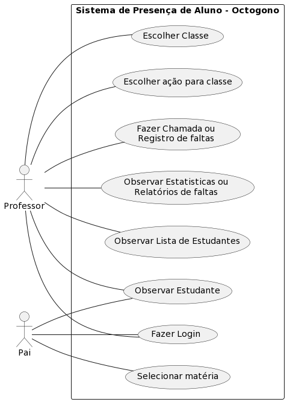
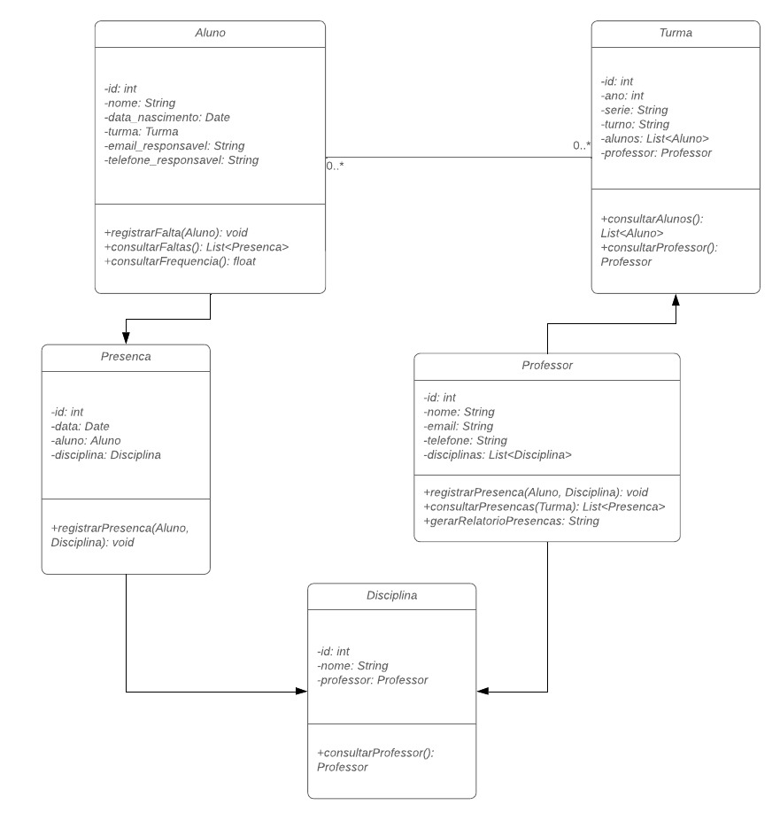
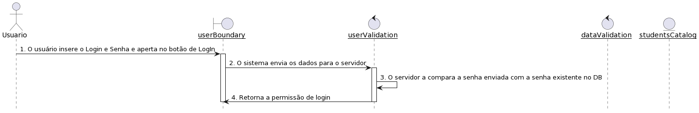
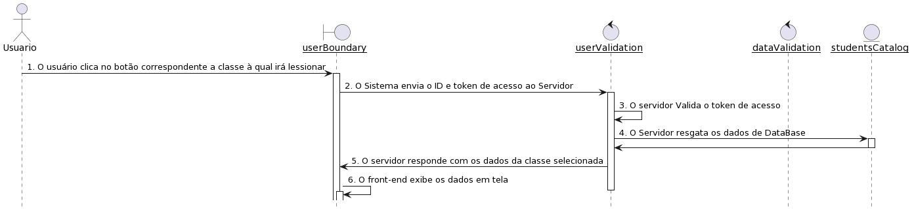
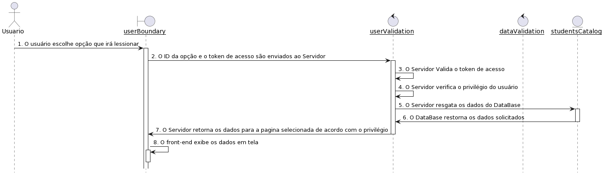
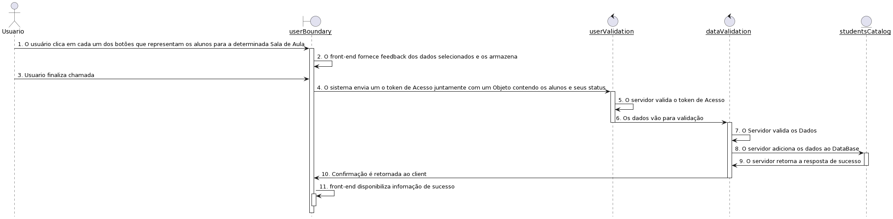
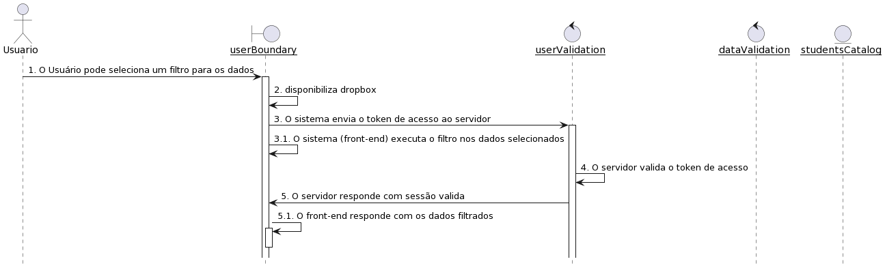
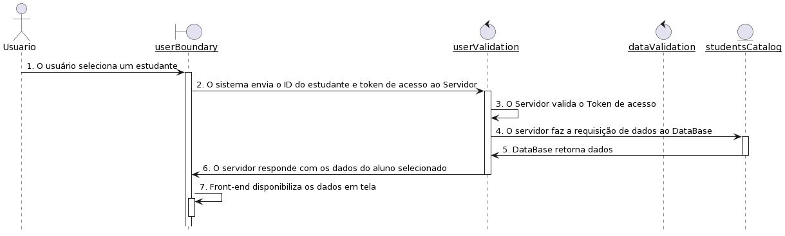
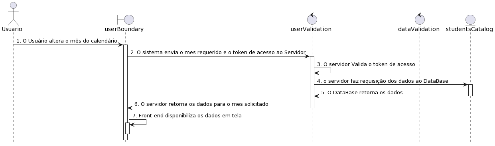
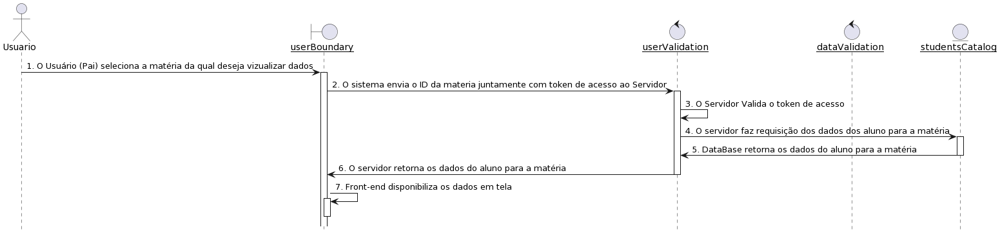

## Índice
- [Introdução](#introdução)
- [Informações sobre a empresa](#informações-sobre-a-empresa)
- [Escopo do projeto](#escopo-do-projeto)
- [Interessados](#interessados)
- [Objetivos funcionais](#objetivos-funcionais)
- [Objetivos não-funcionais](#objetivos-não-funcionais)
- [COTS (Commercial Off-The-Shelf)](#cots---commercial-off-the-shelf)
- [Casos de uso](#casos-de-uso)
- [Descrição detalhada dos casos de uso principais](#descrição-detalhada-dos-casos-de-uso-principais)
- [Diagrama de Classe](#diagrama-de-classe)
- [Diagrama de Fluxo](#diagrama-de-fluxo)
- [Protótipo de Tela](#prototipagem-de-tela---wireframe)

## Introdução

O projeto tem como objetivo desenvolver um Sistema de Presenças para a Escola Octógono, facilitando o controle de presenças dos alunos. O sistema permitirá aos professores registrar as faltas de forma fácil e intuitiva, além de fornecer relatórios detalhados de faltas, enviar notificações para pais ou responsáveis em casos de faltas excessivas, e ser acessível a todos os usuários.

## Informações sobre a empresa

A Escola Octógono atende alunos do 1º ao 5º ano do Ensino Fundamental I, com turmas que variam entre 20 e 30 alunos. A escola emprega um professor principal por turma, responsável pela maioria das disciplinas, além de professores específicos para matérias como Educação Física e Inglês.

## Escopo do projeto

O Sistema de Presenças, desenvolvido para a Escola Octógono, visa melhorar o controle de frequência dos alunos. O sistema facilitará o registro de faltas pelos professores e permitirá a geração de relatórios de faltas por aluno, turma e data, para facilitar o acompanhamento acadêmico. Também enviará notificações automáticas para os responsáveis quando as faltas se aproximarem de um limite crítico. Será acessível por meio de navegadores web e dispositivos móveis, garantindo que todos, incluindo usuários com deficiência, tenham igual acesso às funcionalidades do sistema.

## Interessados

Os interessados no projeto incluem:
- Professores e funcionários da Escola Octógono.
- Alunos e seus pais ou responsáveis.
- A administração da Escola Octógono.

## Objetivos funcionais

**Automatização do Registro de Faltas:** Implementar uma interface de usuário para que professores registrem faltas de alunos com eficiência e precisão.

**Geração de Relatórios de Faltas:** Desenvolver um sistema de relatório que compila dados de faltas, permitindo filtragem por diversos critérios como data, ano escolar, turma, professor, disciplina e aluno.

**Sistema de Notificações Automáticas:** Criar um mecanismo de alerta que notifica os responsáveis quando o aluno excede um limite pré-estabelecido de faltas.

## Objetivos não-funcionais

**Acessibilidade**: O sistema será projetado para ser facilmente utilizado por todas as pessoas, assegurando igualdade no acesso às suas funcionalidades.

**Compatibilidade**: Deve funcionar de forma consistente e eficaz em uma variedade de navegadores web, e ser responsivo para uso em smartphones e tablets.

**Usabilidade**: A interface de usuário deve ser intuitiva, com uma curva de aprendizado mínima, permitindo que os professores realizem o registro de faltas rapidamente, com um mínimo de cliques ou interações.

## COTS - Commercial Off-The-Shelf

O projeto utilizará Django para o backend, fornecendo uma base sólida para o sistema e gerenciamento de dados. O Vue.js será empregado no frontend para uma interface de usuário interativa. Para as notificações automáticas, serviços de envio de e-mails serão integrados.

## Casos de uso

**Registro de Presenças:** Permite ao professor registrar as presenças e faltas dos alunos.

**Consulta de Relatórios:** Permite visualizar relatórios de faltas por diversos filtros.

**Envio de Notificações:** Automatiza o envio de e-mails para notificar sobre faltas excessivas.
 
<figure>
    
    <a href="https://github.com/FelipeGuerra5/ppads-octogono/blob/main/Document/plantuml/diagrama-de-caso-de-uso.md" target="_blank" >Código em PlantUml</a>
</figure>

## Descrição detalhada dos casos de uso principais

### Fazer Login - ( CDU001 )

- **Resumo:** O Professor ou Pai que deseja acessar a plataforma devera realizar o login já pre-registrado pela escola, utilizando o usuário cadastrado e senha;

- **Ator Principal:**
    - Professor
    - Pai

- **Pré-condições:** Estar Cadastrado no sistema

- **Pós-condições:** Acessar o conteúdo pertinente a cada papel (Pai, ou Professor)

- **Fluxo Principal:**
    
    1. O usuário insere o Login e Senha e aperta no botão de LogIn
    2. O sistema envia os dados para o servidor
    3. O servidor a compara a senha enviada com a senha existente no DB
    4. Retorna a permissão de login

- **Fluxo de Exceção:**
    1. O usuário insere o Login e Senha e aperta no botão de LogIn
    2. O sistema envia os dados para o servidor
    3. O servidor compara a senha com a senha existente no DB 
    4. Retorna mensagem de Senha Inválida

### Escolher Classe - ( CDU002 )

- **Resumo:** O Professor pode Selecionar a classe que à qual ira lecionar no momento da chamada, para os professores de apenas uma matéria esta etapa pode ser pulada diretamente para as opções de turma

- **Ator Principal:** Professor

- **Pré-condições:** Ter Feito Login

- **Pós-condições:** Acesso à turma Selecionada

- **Fluxo Principal:**
    
    1. O usuário clica no botão correspondente a classe à qual irá lessionar
    2. O Sistema envia o ID e token de acesso ao Servidor
    3. O servidor Valida o token de acesso
    4. O servidor responde com os dados da classe selecionada
    5. O servidor responde com os dados da classe selecionada
    6. O front-end exibe os dados em tela

- **Fluxo de Exceção:** 

    1. O usuário clica no botão correspondente a classe à qual irá lessionar
    2. O Sistema envia o ID e token de acesso ao Servidor
    3. O servidor não Valida o token de acesso
    4. O servidor responde com seção expirada.
    5. O usuário é levado para a tela de Login novamente

### Escolher ação para classe - ( CDU003 )

- **Resumo:** O Professor pode escolher entre 3 opçoes, *Fazer Chamada*, *Verificar Estatísticas* ou *Ver Lista de Alunos*

- **Ator Principal:** Professor

- **Pré-condições:** Ter Selecionado a turma

- **Pós-condições:** Acessar a página escolhida

- **Fluxo Principal:**
    
    1. O usuário escolhe opção que irá lessionar
    2. O ID da opção e o token de acesso são enviados ao Servidor
    3. O Servidor Valida o token de acesso
    4. O Servidor verifica o privilégio do usuário
    5. O Servidor resgata os dados do DataBase
    6. O DataBase restorna os dados solicitados
    7. O Servidor retorna os dados para a pagina selecionada de acordo 
    8. O front-end exibe os dados em tela
    
    Obs:  O fluxo para os tres items é o mesmo, variando somente o ID e permissões

- **Fluxo de Exceção:**

    1. O usuário clica no botão correspondente a classe à qual irá lessionar
    2. O Sistema envia o ID e token de acesso ao Servidor
    3. O servidor não Valida o token de acesso
    4. O servidor responde com seção expirada.
    5. O usuário é levado para a tela de Login novamente

### Fazer Chamada ou Registro de faltas - ( CDU004 )

- **Resumo:** O Professor irá selecionar os alunos presentes clicando sobre o nome, após o término da chamada os presenças serão contabilizadas pelo sistema

- **Ator Principal:** Professor

- **Pré-condições:** Ter Acessado a pagina de chamada da turma

- **Pós-condições:** Gravação dos dados de chamada

- **Fluxo Principal:**
    
    1. O usuário clica em cada um dos botões que representam os 
    2. O front-end fornece feedback dos dados selecionados e os 
    3. Usuario finaliza chamada
    4. O sistema envia um o token de Acesso juntamente com um Objeto 
    5. O servidor valida o token de Acesso
    6. Os dados vão para validação
    7. O Servidor valida os Dados
    8. O servidor adiciona os dados ao DataBase
    9. O servidor retorna a resposta de sucesso
    10. Confirmação é retornada ao client
    11. Front-end disponibiliza infomação de sucesso

- **Fluxo de Exceção:**
    
    1. O usuário clica no botão de Finalizar Chamada
    2. O Sistema envia o ID e token de acesso ao Servidor
    3. O servidor não Valida o token de acesso
    4. O servidor responde com seção expirada.
    5. O usuário é levado para a tela de Login novamente

    OU

    1. O usuário clica no botão de Finalizar Chamada
    2. O Sistema envia o ID e token de acesso ao Servidor
    3. O servidor Valida o token de acesso
    4. O Servidor valida os Dados
    5. O servidor responde dados inválidos
    6. O usuário recebe a mensagem de "Preencher novamente a Chamada"

### Observar Estatisticas ou Relatórios de faltas - ( CDU005 )

- **Resumo:** O Professor poderá ver as estatísticas de maneira simples nesta página, com os dados de quantas aulas houveram e um grafico mostrando quanto das aulas cada alunos estava presente

- **Ator Principal:** Professor

- **Pré-condições:** Ter Acessado a pagina de estatísticas

- **Pós-condições:** Ter acesso as estatísticas de presença dos alunos

- **Fluxo Principal:**
    
    1. O Usuário pode seleciona um filtro para os dados
    2. disponibiliza dropbox
    3. O sistema envia o token de acesso ao servidor
        1. O sistema (front-end) executa o filtro nos dados selecionados
    4. O servidor valida o token de acesso
    5. O servidor responde com sessão valida
        1. O front-end responde com os dados filtrados

- **Fluxo de Exceção:**
    1. O usuário clica no botão correspondente ao filtro que deseja vizualizar
    2. O Sistema envia o ID e token de acesso ao Servidor
    3. O servidor não Valida o token de acesso
    4. O servidor responde com seção expirada.
    5. O usuário é levado para a tela de Login novamente

### Observar Lista de Estudantes - ( CDU006 )

- **Resumo:** O professor poderá observar a lista de alunos ao clicar em algum aluno Observar Estudante

- **Ator Principal:** Professor

- **Pré-condições:** Ter acessado Lista de Alunos

- **Pós-condições:** Poder Observar Estudante

- **Fluxo Principal:**  
    1. O usuário seleciona um estudante
    2. O sistema envia o ID do estudante e token de acesso ao Servidor
    3. O Servidor valida o Token de acesso
    4. O servidor faz a requisição de dados ao DataBase
    5. DataBase retorna dados
    6. O servidor responde com os dados do aluno selecionado 
    7. Front-end disponibiliza os dados em tela

- **Fluxo de Exceção:**
    1. O usuário clica no botão correspondente ao estudante que deseja vizualizar
    2. O Sistema envia o ID e token de acesso ao Servidor
    3. O servidor não Valida o token de acesso
    4. O servidor responde com seção expirada.
    5. O usuário é levado para a tela de Login novamente

### Observar Estudante - ( CDU007 )

- **Resumo:** Os atores poderão vizualizar a estatística referente ao aluno selecionado, no caso de pai, somente do filho

- **Ator Principal:** 
    - Professor
    - Pai

- **Pré-condições:** Ter feito Login

- **Pós-condições:** Ter acesso as estatísticas para o dado Aluno

- **Fluxo Principal:**
    
    1. O Usuário altera o mês do calendário.
    2. O sistema envia o mes requerido e o token de acesso ao Servidor
    3. O servidor Valida o token de acesso
    4. O servidor retorna os dados para o mes solicitado

- **Fluxo de Exceção:**
    1. O Usuário altera o mês do calendário.
    2. O sistema envia o mes requerido e o token de acesso ao Servidor
    3. O servidor não Valida o token de acesso
    4. O servidor responde com seção expirada.
    5. O usuário é levado para a tela de Login novamente

### Selecionar matéria - ( CDU008 )

- **Resumo:** O Pai poderá selecionar a matéria a qual quer observar a presença de seu filho

- **Ator Principal:** Pai

- **Pré-condições:** ter feito Login

- **Pós-condições:** Ter Acesso as presenças de seu filho

- **Fluxo Principal:**
    
    1. O Usuário (Pai) seleciona a matéria da qual deseja 
    2. O sistema envia o ID da materia juntamente com token de acesso 
    3. O Servidor Valida o token de acesso
    4. O servidor faz requisição dos dados dos aluno para a matéria
    5. DataBase retorna os dados do aluno para a matéria
    6. O servidor retorna os dados do aluno para a matéria
    7. Front-end disponibiliza os dados em tela

- **Fluxo de Exceção:**
    1. O usuário clica no botão correspondente a matéria que deseja vizualizar dados
    2. O Sistema envia o ID e token de acesso ao Servidor
    3. O servidor não Valida o token de acesso
    4. O servidor responde com seção expirada.
    5. O usuário é levado para a tela de Login novamente

## Diagrama de Classe

## Diagrama de fluxo
- [Códigos PlantUml dos Diagrama de fluxo](https://github.com/FelipeGuerra5/ppads-octogono/blob/main/Document/plantuml/diagrama-de-fluxo.md)

### Fazer Login - ( CDU001 )

### Escolher Classe - ( CDU002 )

### Escolher ação para classe - ( CDU003 )

### Fazer Chamada ou Registro de faltas - ( CDU004 )

### Observar Estatisticas ou Relatórios de faltas - ( CDU005 )

### Observar Lista de Estudantes - ( CDU006 )

### Observar Estudante - ( CDU007 )

### Selecionar matéria - ( CDU008 )

## Prototipagem de Tela - wireframe
 

### Login

 

### Teacher Landing Page

 

### Patent Landing Page

 

### Student In Class

 

### Teacher Class Options

 

### Take Attendance

 

### Teacher Class Stats

 

### Student List

 

### Student

 

### Mobile Navegation Bar

