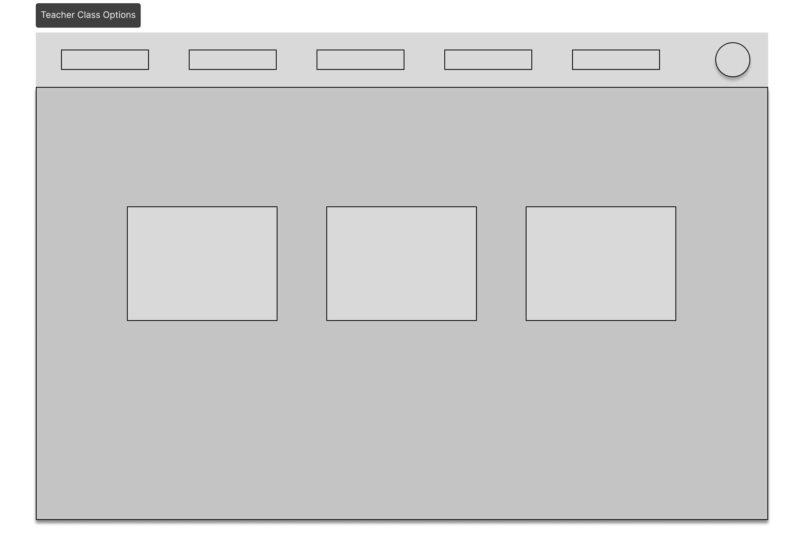

## Índice
- [Introdução](#introdução)
- [Informações sobre a empresa](#informações-sobre-a-empresa)
- [Escopo do projeto](#escopo-do-projeto)
- [Interessados](#interessados)
- [Objetivos funcionais](#objetivos-funcionais)
- [Objetivos não-funcionais](#objetivos-não-funcionais)
- [COTS (Commercial Off-The-Shelf)](#cots---commercial-off-the-shelf)
- [Casos de uso](#casos-de-uso)
- [Descrição detalhada dos casos de uso principais](#descrição-detalhada-dos-casos-de-uso-principais)
- [Protótipo de Tela](#prototipagem-de-tela---wireframe)

## Introdução

O projeto tem como objetivo desenvolver um Sistema de Presenças para a Escola Octógono, facilitando o controle de presenças dos alunos. O sistema permitirá aos professores registrar as faltas de forma fácil e intuitiva, além de fornecer relatórios detalhados de faltas, enviar notificações para pais ou responsáveis em casos de faltas excessivas, e ser acessível a todos os usuários.

## Informações sobre a empresa

A Escola Octógono atende alunos do 1º ao 5º ano do Ensino Fundamental I, com turmas que variam entre 20 e 30 alunos. A escola emprega um professor principal por turma, responsável pela maioria das disciplinas, além de professores específicos para matérias como Educação Física e Inglês.

## Escopo do projeto

O Sistema de Presenças, desenvolvido para a Escola Octógono, visa melhorar o controle de frequência dos alunos. O sistema facilitará o registro de faltas pelos professores e permitirá a geração de relatórios de faltas por aluno, turma e data, para facilitar o acompanhamento acadêmico. Também enviará notificações automáticas para os responsáveis quando as faltas se aproximarem de um limite crítico. Será acessível por meio de navegadores web e dispositivos móveis, garantindo que todos, incluindo usuários com deficiência, tenham igual acesso às funcionalidades do sistema.

## Interessados

Os interessados no projeto incluem:
- Professores e funcionários da Escola Octógono.
- Alunos e seus pais ou responsáveis.
- A administração da Escola Octógono.

## Objetivos funcionais

**Automatização do Registro de Faltas:** Implementar uma interface de usuário para que professores registrem faltas de alunos com eficiência e precisão.

**Geração de Relatórios de Faltas:** Desenvolver um sistema de relatório que compila dados de faltas, permitindo filtragem por diversos critérios como data, ano escolar, turma, professor, disciplina e aluno.

**Sistema de Notificações Automáticas:** Criar um mecanismo de alerta que notifica os responsáveis quando o aluno excede um limite pré-estabelecido de faltas.

## Objetivos não-funcionais

**Acessibilidade**: O sistema será projetado para ser facilmente utilizado por todas as pessoas, assegurando igualdade no acesso às suas funcionalidades.

**Compatibilidade**: Deve funcionar de forma consistente e eficaz em uma variedade de navegadores web, e ser responsivo para uso em smartphones e tablets.

**Usabilidade**: A interface de usuário deve ser intuitiva, com uma curva de aprendizado mínima, permitindo que os professores realizem o registro de faltas rapidamente, com um mínimo de cliques ou interações.

## COTS - Commercial Off-The-Shelf

O projeto utilizará Django para o backend, fornecendo uma base sólida para o sistema e gerenciamento de dados. O Vue.js será empregado no frontend para uma interface de usuário interativa. Para as notificações automáticas, serviços de envio de e-mails serão integrados.

## Casos de uso

**Registro de Presenças:** Permite ao professor registrar as presenças e faltas dos alunos.

**Consulta de Relatórios:** Permite visualizar relatórios de faltas por diversos filtros.

**Envio de Notificações:** Automatiza o envio de e-mails para notificar sobre faltas excessivas.
 

## Descrição detalhada dos casos de uso principais

**Registro de Presenças:** Este caso de uso permite ao professor acessar o sistema no início das aulas e após o intervalo para registrar as presenças e faltas dos alunos. O professor loga no sistema, seleciona a turma correspondente e marca os alunos como presentes ou ausentes. O sistema deve validar se o professor está autorizado para a turma e registrar corretamente as presenças e faltas. Deve também atualizar o banco de dados em tempo real para manter o acompanhamento da frequência dos alunos e oferecer uma interface amigável e intuitiva.

**Consulta de Relatórios:** Neste caso de uso, o sistema disponibiliza a geração de relatórios de faltas, que podem ser personalizados e agrupados por critérios variados, como data, ano, turma, professor, disciplina e aluno. O objetivo é facilitar a análise e o acompanhamento de faltas por parte dos professores e da administração da escola. Os relatórios devem ser de fácil compreensão e devem permitir a exportação dos dados para outros formatos, como PDF ou planilhas, se necessário.

**Envio de Notificações:** Quando o sistema identifica que um aluno está com o percentual de presença abaixo de 80%, ele automaticamente dispara uma notificação para os pais ou responsáveis. Esse processo deve garantir que as notificações sejam enviadas de maneira confiável e segura, com a opção de acompanhar o envio e recebimento das mensagens.

## Prototipagem de Tela - wireframe
 

### Login

 

### Teacher Landing Page

 

### Patent Landing Page

 

### Student In Class

 

### Teacher Class Options

 

### Take Attendance

 

### Teacher Class Stats

 

### Student List

 

### Student

 

### Mobile Navegation Bar

